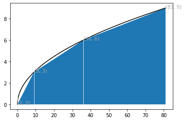
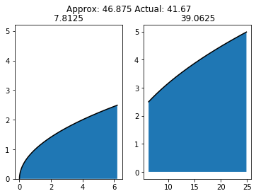

## Newton's Second Law of Motion

$y(t) = v_0 t - \frac{1}{2} g t^2$


```python
5 * 0.6 - 0.5 * 9.81 * 0.6 ** 2
```


    1.2342


## Height of an object

$y(t)=v_0t-\frac{1}{2}gt^2$


 * v0 as initial velocity of objects
 * g
acceleration of gravity
 * t as time


With y=0 as axis of object start when t=0
at initial time.

$v_0t-\frac{1}{2}gt^2 = t(v_0-\frac{1}{2}gt)=0 \Rightarrow
t=0$ or $t=\frac{v_0}{g}$

 * time to move up and return to y=0, return seconds
is $\frac{2 v_0}{g}$
 and restricted to $t \in \left[ 0, \  \frac{2
v_{0}}{g}\right]$


```python
# variables for newton's second law of motion
v0 = 5
g = 9.81
t = 0.6
y = v0*t - 0.5*g*t**2
print(y)
```

    1.2342


```python
# or using good pythonic naming conventions
initial_velocity = 5
acceleration_of_gravity = 9.81
TIME = 0.6
VerticalPositionOfBall = initial_velocity*TIME - \
                         0.5*acceleration_of_gravity*TIME**2
print(VerticalPositionOfBall)
```

    1.2342


## Integral calculation
$$
\int_{-\infty}^1 e^{-x^2}dx{\thinspace .}
$$


```python
from numpy import *

def integrate(f, a, b, n=100):
    """
    Integrate f from a to b
    using the Trapezoildal rule with n intervals.
    """
    x = linspace(a, b, n+1)  # coords of intervals
    h = x[1] - x[0]
    I = h*(sum(f(x)) - 0.5*(f(a) + f(b)))
    return I

# define integrand
def my_function(x):
    return exp(-x**2)

minus_infinity = -20 # aprox for minus infinity
I = integrate(my_function, minus_infinity, 1, n=1000)
print("value of integral:", I)
```

    value of integral: 1.6330240187288536


```python
# Celsius-Fahrenheit Conversion
C = 21
F = (9/5)*C + 32
print(F)
```

    69.80000000000001


## Time to reach height of $y_c$

$y_c =v_0 t - \frac{1}{2} g t^2$

Quadratic
equation to solve.

$\frac{1}{2}gt^2-v_0t+y_c=0$

$t_1=\Bigg(v_0-\sqrt{v_0^2-2gy_c}\Bigg)/g\quad$up$\quad(t=t_1)$

$t_2=\Bigg(v_0+\sqrt{v_0^2-2gy_c}\Bigg)/g\quad$down$\quad(t=t_2>t_1)$


```python
v0 = 5
g = 9.81
yc = 0.2
import math
t1 = (v0 - math.sqrt(v0**2 - 2 * g * yc)) / g
t2 = (v0 + math.sqrt(v0**2 - 2 * g * yc)) / g
print('At t=%g s and %g s, the height is %g m.' % (t1, t2, yc))
```

    At t=0.0417064 s and 0.977662 s, the height is 0.2 m.


## The hyperbolic sine function $sinh(x) = \frac{1}{2}(e^x - e^{-x})$ and other math functions with right hand sides.


```python
from math import sinh, exp, e, pi
x = 2*pi
r1 = sinh(x)
r2 = 0.5*(exp(x) - exp(-x))
r3 = 0.5*(e**x - e**(-x))
print(r1, r2, r3) # with rounding errors
```

    267.74489404101644 267.74489404101644 267.7448940410163


```python
# Math functions for complex numbers
from scipy import *

from cmath import sqrt
sqrt(-1)  # complex number with cmath

from numpy.lib.scimath import sqrt
a = 1; b = 2; c = 100
r1 = (-b + sqrt(b**2 - 4*a*c))/(2*a)
r2 = (-b - sqrt(b**2 - 4*a*c))/(2*a)
print("""
t1={r1:g}
t2={r2:g}""".format(r1=r1, r2=r2))
```

    
    t1=-1+9.94987j
    t2=-1-9.94987j


```python
# Symbolic computing
from sympy import (
    symbols,  # define symbols for symbolic math
    diff,  # differentiate expressions
    integrate,  # integrate expressions
    Rational,  # define rational numbers
    lambdify,  # turn symbolic expr. into python functions
    )

# declare symbolic variables
t, v0, g = symbols('t v0 g')
# formula
y = v0*t - Rational(1,2)*g*t**2
dydt = diff(y ,t)
print("At time", dydt)
print("acceleration:", diff(y,t,t)) # 2nd derivative
y2 = integrate(dydt, t)
print("integration of dydt wrt t", y2)

# convert to python function
v = lambdify([t, v0, g],  # arguments in v
             dydt)  # symbolic expression
print("As a function compute y = %g" % v(t=0, v0=5, g=9.81))
```

    At time -g*t + v0
    acceleration: -g
    integration of dydt wrt t -g*t**2/2 + t*v0
    As a function compute y = 5


```python
# equation solving for expression e=0, t unknown
from sympy import solve
roots = solve(y, t)  # e is y
print("""
If y = 0 for t then t solves y for [{},{}].

""".format(
            y.subs(t, roots[0]),
            y.subs(t, roots[1])
          ) )
```

    
    If y = 0 for t then t solves y for [0,0].
    
    


$y(t)=v_0t-\frac{1}{2}gt^2$,
$t \in [0, \frac{2 v_0}{g}]$


```python
# Taylor series to the order n in a variable t around the point t0
from sympy import exp, sin, cos
f = exp(t)
f.series(t, 0, 3)
f_sin = exp(sin(t))
f_sin.series(t, 0, 8)
```


$\displaystyle 1 + t + \frac{t^{2}}{2} - \frac{t^{4}}{8} - \frac{t^{5}}{15} - \frac{t^{6}}{240} + \frac{t^{7}}{90} + O\left(t^{8}\right)$


## Taylor Series Polynomial to approximate functions; 
$1 + t + \frac{t^{2}}{2} -
\frac{t^{4}}{8} - \frac{t^{5}}{15} - \frac{t^{6}}{240} + \frac{t^{7}}{90} +
O\left(t^{8}\right)$


```python
# expanding and simplifying expressions
from sympy import simplify, expand
x, y = symbols('x y')
f = -sin(x) * sin(y) + cos(x) * cos(y)
print(f)
print(simplify(f))
print(expand(sin(x + y), trig=True))  # expand as trig funct
```

    -sin(x)*sin(y) + cos(x)*cos(y)
    cos(x + y)
    sin(x)*cos(y) + sin(y)*cos(x)


## Trajectory of an object
$$f(x) = x tan \theta - \frac{1}{2 v^{2}_{0}} \cdot
\frac{gx^2}{cos^{2}\theta} + y_0$$


```python
# Trajectory of an object
g = 9.81      # m/s**2
v0 = 15       # km/h
theta = 60    # degree
x = 0.5       # m
y0 = 1        # m

print("""\
v0      = %.1f km/h
theta   = %d degree
y0      = %.1f m
x       = %.1f m\
""" % (v0, theta, y0, x))

from math import pi, tan, cos
v0 = v0/3.6             # km/h 1000/1 to m/s 1/60
theta = theta*pi/180    # degree to radians

y = x*tan(theta) - 1/(2*v0**2)*g*x**2/((cos(theta))**2)+y0
print("y       = %.1f m" % y)
```

    v0      = 15.0 km/h
    theta   = 60 degree
    y0      = 1.0 m
    x       = 0.5 m
    y       = 1.6 m


## Conversion from meters to British units


```python
# Convert meters to british length.
meters = 640
m = symbols('m')
in_m = m/(2.54)*100
ft_m = in_m / 12
yrd_m = ft_m / 3
bm_m = yrd_m / 1760

f_in_m = lambdify([m], in_m)
f_ft_m = lambdify([m], ft_m)
f_yrd_m = lambdify([m], yrd_m)
f_bm_m = lambdify([m], bm_m)

print("""
Given {meters:g} meters conversions for;
inches are {inches:.2f} in
feet are {feet:.2f} ft
yards are {yards:.2f} yd
miles are {miles:.3f} m
""".format(meters=meters,
           inches=f_in_m(meters),
           feet=f_ft_m(meters),
           yards=f_yrd_m(meters),
           miles=f_bm_m(meters)))
```

    
    Given 640 meters conversions for;
    inches are 25196.85 in
    feet are 2099.74 ft
    yards are 699.91 yd
    miles are 0.398 m
    


## Gaussian function 
$$f(x) = \frac{1}{\sqrt{2\pi}s} \text{exp} \Bigg[
-{\frac{1}{2} \Big( \frac{x-m}{s} \Big)^2} \Bigg]$$


```python
from sympy import pi, exp, sqrt, symbols, lambdify

s, x, m = symbols("s x m")
y = 1/ (sqrt(2*pi)*s) * exp(-0.5*((x-m)/s)**2)
gaus_d = lambdify([m, s, x], y)
gaus_d(m = 0, s = 2, x = 1)
```


    0.1760326633821498


## Drag force due to air resistance on an object as the expression;

$$
F_d =
\frac{1}{2} C_D \varrho A V^2
$$
Where
 * $C_D$ drag coefficient (based on
roughness and shape)
   * As 0.4
 * $\varrho$ is air density
   * Air density of
air is $\varrho$ = 1.2 kg/m$^{-3}$
 * V is velocity of the object 
 * A is the
cross-sectional area (normal to the velocity direction)
   * $A = \pi a^{2}$ for
an object with a radius $a$
   * $a$ = 11 cm

Gravity Force on an object with
mass $m$ is $F_g = mg$
Where
 * $g$ = 9.81 m/s$^{-2}$
 * mass = 0.43kg

$F_d$
and $F_g$ results
in a difference relationship between air
resistance versus
gravity at impact
time

$$\frac{kg}{m^{-3}} \qquad and \qquad \frac{m}{s^{-2}}$$


```python
from sympy import (Rational, lambdify, symbols, pi)

g = 9.81  # gravity in m/s**(-2)
air_density = 1.2  # kg/m**(-3)
a = 11  # radius in cm
x_area = pi * a**2  # cross-sectional area
m = 0.43  # mass in kg
Fg = m * g  # gravity force
high_velocity = 120 / 3.6  # impact velocity in km/h
low_velocity = 30 / 3.6  # impact velocity in km/h

Cd, Q, A, V = symbols("Cd Q A V")
y = Rational(1, 2) * Cd * Q * A * V**2
drag_force = lambdify([Cd, Q, A, V], y)

Fd_low_impact = drag_force(Cd=0.4,
                       Q=air_density,
                       A=x_area,
                       V=low_velocity)

Fd_high_impact = drag_force(Cd=0.4,
                       Q=air_density,
                       A=x_area,
                       V=high_velocity)

print("ratio of drag force=%.1f and gravity force=%.1f: %.1f" % \
      (Fd_low_impact, Fg, float(Fd_low_impact/Fg)))

print("ratio of drag force=%.1f and gravity force=%.1f: %.1f" % \
      (Fd_high_impact, Fg, float(Fd_high_impact/Fg)))
```

    ratio of drag force=6335.5 and gravity force=4.2: 1501.9
    ratio of drag force=101368.7 and gravity force=4.2: 24030.7


## Critical temperature of an object

$$t=\frac{M^{2/3} c \rho^{1/3}} {K \pi^2 (4\pi/3)^{2/3}}\log{\left[0.76 \frac{\left(T_o - T_w\right)}{- T_w + T_y} \right]}$$

An object heats at the center differently from it's outside, an objects center may also have a different density than it's outside.


```python
def critical_temp(init_temp=4, final_temp=70, water_temp=100,
                  mass=47, density=1.038, heat_capacity=3.7,
                  thermal_conductivity=5.4*10**-3):
    """Calculates the time for the center critical temp as a function 
    of temperature of applied heat where exceeding passes a critical point.

    Heating to a temperature with prevention to exceeding critical
    points. Be defining critial temperature points based on
    composition, e.g., 63 degrees celcius outter and 70 degrees
    celcius inner we can express temperature and time as a
    function.

    t = (M**(2/3)*c*rho**(1/3)/(K*pi**2*(4*pi/3)**(2/3)))*(ln(0.76*((To-Tw)/(Ty-Tw))))

    Arguments:
        init_temp: initial temperature in C of object e.g., 4, 20
        final_temp: desired temperature in C of object e.g., 70
        water_temp: temp in C for boiling water as a conductive fluid e.g., 100
        mass: Mass in grams of an object, e.g., small: 47, large: 67
        density: rho in g cm**-3 of the object e.g., 1.038
        heat_capacity: c in J g**-1 K-1 e.g., 3.7
        thermal_conductivity: in W cm**-1 K**-1 e.g., 5.4*10**-3
    Returns: Time as a float in seconds to reach temperature Ty.
    """
    from sympy import symbols
    from sympy import lambdify
    from sympy import sympify
    from numpy import pi
    from math import log as ln # using ln to represent natural log

    # using non-pythonic math notation create variables
    M, c, rho, K, To, Tw, Ty = symbols("M c rho K To Tw Ty")
    # writing out the formula
    t = sympify('(M**(2/3)*c*rho**(1/3)/(K*pi**2*(4*pi/3)**(2/3)))*(ln(0.76*((To-Tw)/(Ty-Tw))))')
    # using symbolic formula representation to create a function
    time_for_Ty = lambdify([M, c, rho, K, To, Tw, Ty], t)
    # return the computed value
    return time_for_Ty(M=mass, c=heat_capacity, rho=density, K=thermal_conductivity,
                       To=init_temp, Tw=water_temp, Ty=final_temp)


```


```python
critical_temp()
```


    313.09454902221626


```python
critical_temp(init_temp=20)
```


    248.86253747844728


```python
critical_temp(mass=70)
```


    408.3278117759983


```python
critical_temp(init_temp=20, mass=70)
```


    324.55849416396666


## Newtons second law of motion in direction x and y, aka accelerations:

$F_x = ma_x$ is the sum of force, ```m*a_x (mass * acceleration)```

$a_x = \frac {d^{2}x}{dt^{2}}$, ```ax = (d**2*x)/(d*t**2)```

With gravity from $F_x$ as 0 as $x(t)$ is in the horizontal position at time t

$F_y = ma_y$ is the sum of force, ```m*a_y```

$a_y = \frac {d^{2}y}{dt^{2}}$, ```ay = (d**2*y)/(d*t**2)```

With gravity from $F_y$ as $-mg$ since $y(t)$ is in the veritcal postion at time t


Let coodinate $(x(t), y(t))$ be horizontal and verical positions to time t then we can integrate Newton's two components, $(x(t), t(t))$ using the second law twice with initial velocity and position with respect to t

$\frac{d}{dt}x(0)=v_0 cos\theta$

$\frac{d}{dt}y(0)=v_0 sin\theta$

$x(0) = 0$

$y(0) = y_0$

    """
    Derive the trajectory of an object from basic physics.
        Newtons second law of motion in direction x and y, aka accelerations:
            F_x = ma_x is the sum of force, m*a_x (mass * acceleration)
            F_y = ma_y is the sum of force, m*a_y
        let coordinates (x(t), y(t)) be position horizontal and vertical to time t
        relations between acceleration, velocity, and position are derivatives of t

        $a_x = \frac {d^{2}x}{dt^{2}}$, ax = (d**2*x)/(d*t**2)
        $a_y = \frac {d^{2}y}{dt^{2}}$  ay = (d**2*y)/(d*t**2)

        With gravity and F_x = 0 and F_y = -mg

        integrate Newton's the two components, (x(t), y(t)) second law twice with
        initial velocity and position wrt t

        $\frac{d}{dt}x(0)=v_0 cos\theta$
        $\frac{d}{dt}y(0)=v_0 sin\theta$
        $x(0) = 0$
        $y(0) = y_0$

        Derivative(t)x(0) = v0*cos(theta) ; x(0) = 0
        Derivative(t)y(0) = v0*sin(theta) ; y(0) = y0

        from sympy import *
        diff(Symbol(v0)*cos(Symbol(theta)))
        diff(Symbol(v0)*sin(Symbol(theta)))

    theta: some angle, e.g, pi/2 or 90

    Return: relationship between x and y

    # the expression for x(t) and y(t)


    # if theta = pi/2 then motion is vertical e.g., the y position formula

    # if t = 0, or is eliminated then x and y are the object coordinates

    """

#### there isn't any code to this, it just looks at newtons second law of motion


## Sine function as a polynomial
$$sin(x) \approx x - \frac{x^3}{3!} + \frac{x^5}{5!} + \frac{x^7}{7!} + \dotsb$$


```python
x, N, k, sign = 1.2, 25, 1, 1.0
s = x
import math

while k < N:
    sign = - sign
    k = k + 2
    term = sign*x**x/math.factorial(k) 
    s = s + term

print("sin(%g) = %g (approximation with %d terms)" % (x, s, N))
```

    sin(1.2) = 1.0027 (approximation with 25 terms)


## Print table using an approximate Fahrenheit-Celcius conversiion.

For the approximate formula $C \approx \hat{C} = (F-30)/2$ farenheit to celcius conversions are calculated.  Adds a third to conversation_table with an approximate value $\hat{C}$.


```python
F=0; step=10; end=100 # declare
print('------------------')
while F <= end:
    C = F/(9.0/5) - 32
    C_approx = (F-30)/2
    print("{:>3} {:>5.1f} {:>3.0f}".format(F, C, C_approx))
    F = F + step
print('------------------')
```

    ------------------
      0 -32.0 -15
     10 -26.4 -10
     20 -20.9  -5
     30 -15.3   0
     40  -9.8   5
     50  -4.2  10
     60   1.3  15
     70   6.9  20
     80  12.4  25
     90  18.0  30
    100  23.6  35
    ------------------


## Create sequences of odds from 1 to any number.


```python
n = 9 # specify any number
c = 1
while 1 <= n:
    if c%2 == 1:
        print(c)

    c += 1
    n -= 1
```

    1
    3
    5
    7
    9


## Compute energy levels in an atom
Compute the n-th energy level for an electron in an atom, e.g., 
Hydrogen: 

$$E_n = - \frac{m_{e}e^4}{8\epsilon_{0}^{2}h^2}\cdot\frac{1}{n^2}$$

where: 

$m_e = 9.1094 \cdot 10^{-31}$kg is the electron mass

$e = 1.6022 \cdot 10^{-19}$C is the elementary charge

$\epsilon_0 = 8.8542 \cdot 10^{-12}$s$^2$kg$^{-1}$m$^{-3}$ is electrical permittivity of vacuum

$h = 6.6261 \cdot 10^{-34}$Js

Calculates energy level $E_n$ for $n= 1,...,20$


```python
def formula():
    # Symbolic computing
    from sympy import (
        symbols,  # define symbols for symbolic math
        lambdify,  # turn symbolic expr. into python functions
    )

    # declare symbolic variables
    m_e, e, epsilon_0, h, n = symbols('m_e e epsilon_0 h n')
    # formula
    En = -(m_e*e**4)/(8*epsilon_0*h**2)*(1/n**2)

    # convert to python function
    return lambdify([m_e, e, epsilon_0, h, n],  # arguments in En
                 En)  # symbolic expression

def compute_atomic_energy(m_e=9.094E-34, 
                          e=1.6022E-19, 
                          epsilon_0=9.9542E-12,
                          h=6.6261E-34):
    
    En = 0 # energy level of an atom
    for n in range(1, 20): # Compute for 1,...,20
        En += formula()(m_e, e, epsilon_0, h, n)
    
    return En
```


```python
compute_atomic_energy()
```


    -2.7315307541142e-32


and energy released moving from level $n_i$ to $n_f$ is 

$$\Delta E = - \frac{m_{e}e^{4}}{8\epsilon_{0}^{2}h^{2}} 
\cdot \left( \frac{1}{n_{i}^{2}} - \frac{1}{n_{f}^{2}} \right) $$


```python
# Symbolic computing
from sympy import (
    symbols,  # define symbols for symbolic math
    lambdify,  # turn symbolic expr. into python functions
    )

# declare symbolic variables
m_e, e, epsilon_0, h, ni, nf = symbols('m_e e epsilon_0 h ni nf')
# formula
delta_E = -(m_e*e**4)/(8*epsilon_0*h**2)*((1/ni**2)-(1/nf**2))

# convert to python function
y = lambdify([m_e, e, epsilon_0, h, ni, nf],  # arguments in En
             delta_E)  # symbolic expression

def compute_change_in_energy(m_e=9.094E-34, 
                             e=1.6022E-19, 
                             epsilon_0=9.9542E-12,
                             h=6.6261E-34):
    print("Energy released going from level to level.")
    En = y(m_e, e, epsilon_0, h, 2, 1) # energy at level 1
    for n in range(2, 20): # Compute for 1,...,20
        En += y(m_e, e, epsilon_0, h, n-1, n)
        print("{:23.2E}  {:7} to level {:2}".format(
            y(m_e, e, epsilon_0, h, n-1, n),
            n-1,
            n))
    print("Total energy: {:.2E}".format(compute_atomic_energy()))
```


```python
compute_change_in_energy()
```

    Energy released going from level to level.
                  -1.29E-32        1 to level  2
                  -2.38E-33        2 to level  3
                  -8.33E-34        3 to level  4
                  -3.86E-34        4 to level  5
                  -2.09E-34        5 to level  6
                  -1.26E-34        6 to level  7
                  -8.20E-35        7 to level  8
                  -5.62E-35        8 to level  9
                  -4.02E-35        9 to level 10
                  -2.97E-35       10 to level 11
                  -2.26E-35       11 to level 12
                  -1.76E-35       12 to level 13
                  -1.40E-35       13 to level 14
                  -1.13E-35       14 to level 15
                  -9.22E-36       15 to level 16
                  -7.65E-36       16 to level 17
                  -6.41E-36       17 to level 18
                  -5.42E-36       18 to level 19
    Total energy: -2.73E-32


## Numerical root finding, nonlinear approximation: solve $f(x) = 0$;
  
Given the example equation;
  
$$x = 1 + sin \hspace{3 px} x \\ $$

Move all terms on the left hand side to make $x$ the ***root*** of the equation.

$$ f(x) = x - 1 - sin \hspace {3 px} x \\ \\ $$

  Example 1: Bisection method.
  
  On an interval, $[a, b]$, where the root lies that contains a root of $f(x)$ the interval is halved at $m=(a+b)/2$ if the sign of $f(x)$ changes in the left half, $[a, m]$, continue on that side of the halved interval, otherwise continue on the right half interval, $[m, b]$.  The root is guaranteed to be inside an interval of length $2^{-n}(b-a)$. 
  
  </br>
  
  Example 2: Newton's method.
  
  $$x_n = x_{n-1} - 
  \frac{f(x_{n-1})}{f'(x_{n-1})}, 
  \quad x_{0} \hspace{6 px} given \\ \\ $$
  
  
  Generates a sequence $x_n$ where if the sequence converges to 0, $x_n$ approaches the root of $f(x)$.  That is $x_n \rightarrow x$ where $x$ solves the equation $f(x) = 0$.
  
When $f(x)$ is not linear i.e., $f(x)$ is not in the form $ax+b$ with constant and b we have a nonlinear difference equation.  If we have an approximate solution $x_{n-1}$ and if $f(x)$ were linear, $f(x) = ax+b$, we could solve $f(x) = 0:x = -b/a$ and if $f(x)$ is approximatly close to $x = x_{n-1}$ then $f(x) \approx \tilde{f} = ax+b$, the slope would be approximately $a = f'(x_{n-1})$, $x = x_{n-1}$, $b=f(x_{n-1})-x_{n-1}f'(x_{n-1})$, then the approximate line function would be 

$$\tilde{f}(x)=f(x_{n-1})-x_{n-1}f'(x_{n-1}) \\ \\ $$

Which is the first two terms in Taylor series approximation, and solving for $\tilde{f}(x)=0$ 

$$x=x_{n-1}-\frac{f(x_{n-1})}{f'(x_{n-1})}$$.

Newton's method relies on convergence to an approximation root with $N$ number of a sequence where divergence may occur, thus we increase $x_n$ until a small $f(x_n)$ with increasing $n$ until $f(x_n) < \epsilon$ of some small $\epsilon$ and some maximum $N$ for accounting to divergence.  


```python
# Example 1.
def f(x):
  """The function f(x) = x - 1 sin x"""
  from math import sin
  return x - 1 - sin(x)

a = 0
b = 10 
fa = f(a)
if fa*f(b) > 0:
  m = 0

i = 0
while b-a > 1E-6:
  i += 1
  m = (a + b)/2.0
  fm = f(m)
  if fa*fm <= 0:
    b = m
  else:
    a = m
    fa = fm
m, i
```


    (1.9345635175704956, 24)


##### As a python program and less like a calculator


```python
import sys

def f(x):
    """The function f(x) = x - 1 sin x"""
    from math import sin
    return x - 1 - sin(x)


eps = 1E-6
a, b = 0, 10

fa = f(a)
if fa*f(b) > 0:
    print("f(x) does not change sign in [{:g}, {:g}]".format(a, b))
    sys.exit(1)

i = 0
while b-a > eps:
    i += 1
    m = (a + b)/2.0
    fm = f(m)
    if fa*fm <= 0:
        b = m
    else:
        a = m
        fa = fm
    print("Iteration {:d}: interval=[{:g}, {:g}]".format(i, a, b))
x = m
print("The root is ", x, "found in", i, "iterations")
print("f({:g})={:g})".format(x, f(x)))
```

    Iteration 1: interval=[0, 5]
    Iteration 2: interval=[0, 2.5]
    Iteration 3: interval=[1.25, 2.5]
    Iteration 4: interval=[1.875, 2.5]
    Iteration 5: interval=[1.875, 2.1875]
    Iteration 6: interval=[1.875, 2.03125]
    Iteration 7: interval=[1.875, 1.95312]
    Iteration 8: interval=[1.91406, 1.95312]
    Iteration 9: interval=[1.93359, 1.95312]
    Iteration 10: interval=[1.93359, 1.94336]
    Iteration 11: interval=[1.93359, 1.93848]
    Iteration 12: interval=[1.93359, 1.93604]
    Iteration 13: interval=[1.93359, 1.93481]
    Iteration 14: interval=[1.9342, 1.93481]
    Iteration 15: interval=[1.93451, 1.93481]
    Iteration 16: interval=[1.93451, 1.93466]
    Iteration 17: interval=[1.93451, 1.93459]
    Iteration 18: interval=[1.93455, 1.93459]
    Iteration 19: interval=[1.93455, 1.93457]
    Iteration 20: interval=[1.93456, 1.93457]
    Iteration 21: interval=[1.93456, 1.93457]
    Iteration 22: interval=[1.93456, 1.93456]
    Iteration 23: interval=[1.93456, 1.93456]
    Iteration 24: interval=[1.93456, 1.93456]
    The root is  1.9345635175704956 found in 24 iterations
    f(1.93456)=4.15984e-07)


```python
# Example 2.
from math import sin, cos

def g(x):
  return x - 1 - sin(x)

def dg(x):
  return 1 - cos(x)

x = 2
n = 0
N = 100
epsilon = 1.0E-7
f_value = g(x)

while abs(f_value) > epsilon and n <= N:
  dfdx_value = float(dg(x))
  x = x - f_value/dfdx_value
  n += 1
  f_value = g(x)
  
x, n, f_value

```


    (1.9345632107521757, 3, 2.0539125955565396e-13)


## Newton's second law of motion

A car driver driving at velocity $v_0$ breaks, how to determine the stopping diststance. Newtons second law of motion, an energy equation; 
$$d = \frac{1}{2} \frac{v_0^2}{\mu g}$$


```python
def stopping_length_function(initial_velocity=120, friction_coefficient=0.3):
    """Newton's second law of motion for measuring stoppnig distance

    Newton's second law of motion is d = (1/2)*(v0**2/(mu*g)) so the stopping
    distance of an object in motion, like a car, can be measured.  The
    friction coefficient measures how slick a road is with a default of 0.3.

    Arguments:
        initial_velocity, v0: 120 km/h or 50 km/h
        friction_coefficient, mu: = 0.3

        >>> stopping_length(50, 0.3)
        188.77185034167707

        >>> stopping_length_function(50, 0.05)
        196.63734410591357


    Returns a real number as a floating point number.
    """
    g = 9.81
    v0 = initial_velocity/3.6
    mu = friction_coefficient

    return (1/2)*(v0**2/(mu*g))
```


```python
stopping_length_function()
```


    188.77185034167707


## A hat function translated into if, else if, else clause
Widely used in advanced computer simulations, a $hat function$ can be represented as an branching statement.

$$N(x) = 
\begin{cases}
 0, & \quad x < 0 \\
 x,  & \quad 0 \le x < 1 \\
 2-x, & \quad 1 \le x < 2 \\ 
 0, & \quad x \ge 2
\end{cases}$$


```python
def N(x):
    if x < 0:
        return 0.0
    elif 0 <= x < 1:
        return x
    elif 1 <= x < 2:
        return 2-x
    elif x >= 2:
        return 0.0
```

## Numerical integration by the Simpson's rule:
Given an integral, $$\int_a^b f(x)dx$$ it's approximation is given by the Simpson's rule.
$$\frac{b-a}{3n} \Bigg( f(a) + f(b) + 4 \sum^{n/2}_{i=1} f(a+2i-1)h) + 2 \sum^{n/2-1}_{i=1} f(a+2ih) \Bigg)$$


```python
def Simpson(f, a, b, n=500):
    """Simpsons's rule approximation."""
    h = (b - a)/float(n)
    sum1 = 0
    for i in range(1, n//2 + 1):
        sum1 += f(a + (2*i-1)*h)
        
    sum2 = 0
    for i in range(1, n//2):
        sum2 += f(a + 2*i*h)
        
    integral = (b-a)/(3*n)*(f(a) + f(b) + 4*sum1 + 2*sum2)
    return integral
```


```python
def test_Simpson():
    """A test function is used in pytest or nose framework format."""
    a = 1.5
    b = 2.0
    n = 8
    g = lambda x: 3.0*x**2 - 7*x + 2.5  # to test the integrand
    G = lambda x: x**3.0 - 3.5*x**2 + 2.5*x # the integral of g
    exact = G(b) - G(a)
    approx = Simpson(g, a, b, n)
    success = abs(exact - approx) < 1E-14
    msg = "Simpson: {:g}, exact: {:g}".format(approx, exact)
    assert success, msg
```

#### Using the integral:
$$\int_{3/2}^{2} (3x^2 - 7x + 2.5) dx$$


```python
def h(x):
    return 3*x**2 - 7*x + 2.5
```


```python
test_Simpson()
```


```python
a, b, = 3.5, 2.0
Simpson(h, a, b)
```


    -9.749999999999996


### Compute a polynomial via a product
Given $n + 1$ roots $ r_0, r_1, \dots, r_n$ of a 
polynomial $p(x)$ of degree $n+1, p(x)$ can be computed by 
$$p(x) = \prod_{i=0}^{n}(x-r_i)=(x-r_0)(x-r_1)\cdots(x-r_{n-1})(x-r_n)$$


```python
x, poly, roots = 1, 1, [2, 4, 7]
for r in roots:
    poly *= x - r
poly
```


    -18


### Integrate a function by the Trapezoidal rule
An approximation to the integral of a function $f(x)$ over an interval $[a, b]$
can be found by approximating $f(x)$ by the straight line of $(a, f(a))$ and $(b, f(b))$
and then finding the area under the straight line, which is the area of a trapezoid.
$$\int_a^b f(x)dx \approx \frac{b-a}{2} (f(a)+f(b))$$


```python
%matplotlib inline
import numpy as np
from scipy.integrate import trapz
from scipy import sqrt
import matplotlib.pyplot as plt

def f(x):
    return x**2

fig, axs = plt.subplots(nrows=1, ncols=1)

x=np.arange(0,9,0.01)
y=f(x)
axs.plot(y,x, 'k-')

#Trapizium
xstep = np.arange(0,10,3)
area=trapz(y,x)
print(area)
axs.fill_between(f(xstep), 0, xstep)

lwbase = plt.rcParams['lines.linewidth']
thin = lwbase / 2

lwx, lwy = thin, thin

for i, x in enumerate(f(xstep)):
    axs.axvline(x, color='white', lw=lwy)
    axs.text(x, xstep[i], (x, xstep[i]), color='darkgrey')
plt.show()
```

    242.19104950000002





```python
def trap_approx(f,a=0,b=5):
    area_trap_rule = (b-a)/2 * (f(a) + f(b))
    print(area_trap_rule)
    return area_trap_rule
```


```python
from scipy import cos, tan, pi, sin
x = trap_approx(lambda x:cos(x)-tan(x))
y = trap_approx(lambda x:x**2)
z = trap_approx(lambda x:2**tan(x))
cosx = trap_approx(lambda x:cos(x),a=0,b=pi)
sinx1 = trap_approx(lambda x:sin(x), a=0, b=pi)
sinx2 = trap_approx(lambda x:sin(x), a=0, b=pi/2)
```

    11.66044297927453
    62.5
    2.7400510395289186
    0.0
    1.9236706937217898e-16
    0.7853981633974483


```python
def trapzint2(f, a=0, b=5):
    half = (a+b)/2
    area = lambda x, y: (b-a)/2 * (f(x) + f(y))
    area1 = area(a, half)
    area2 = area(half, b)
    return (area1 + area2), half, a, b
```


```python
f = lambda x: x**2
area, half, a, b = trapzint2(lambda x:x**2)
fig, axs = plt.subplots(nrows=1, ncols=2)

a1, a2 = trap_approx(f, a, half), trap_approx(f, half, b)
x1 = np.arange(a, half, 0.01)
y1 = f(x1)
axs[0].plot(y1, x1, 'k-')
axs[0].fill_between(y1, x1)
axs[0].set_title(a1)
axs[0].set_ylim(0.0, 5.2)

x2 = np.arange(half, b, 0.01)
y2 = f(x2)
axs[1].plot(y2, x2, 'k-')
axs[1].fill_between(y2, x2)
axs[1].set_title(a2)

from scipy.integrate import quad
area_actual = quad(lambda x:x**2, 0, 5)
fig.suptitle("Approx: " + str(a1+a2) + " Actual: " \
             + str(round(area_actual[0], 2)))
```

    7.8125
    39.0625


    Text(0.5, 0.98, 'Approx: 46.875 Actual: 41.67')





```python
def trapezint(f, a, b, n):
    h = (b - a)/float(n)
    xi = lambda i: a + i * h
    f_list = [f(xi(j)) + f(xi(j+1)) for j in range(1, n)]
    return sum((0.5*h) * z for z in f_list), f_list, a, b, n
```


```python
f = lambda x: x**2
trapezint(f, 0, 5, 10)
```


    (41.8125,
     [1.25, 3.25, 6.25, 10.25, 15.25, 21.25, 28.25, 36.25, 45.25],
     0,
     5,
     10)


```python
area, _, a, b, n = trapezint(f, 0, 5, 100)
area
```


    41.668687500000004


### Midpoint integration rule
$$\int_a^b f(x)dx \approx h \sum_{i=0}^{n-1} f(a + ih + \frac{1}{2} h)$$


```python
def midpointint(f, a, b, n):
    h = (b - a)/float(n)
    area_list = [f(a + i * h + 0.5 * h) for i in range(0, n)]
    area = h * sum(area_list)
    return area
```


```python
midpointint(f, 0, 5, 10)
```


    41.5625


### Adaptive Trapezoidal rule
By using the following equation, a maximum $|f''(x)|$ can be computed by evaluating $f''(x)$ 
at large points in $[a, b]$ of the absolute value of $|f''(x)|$.
$$ E \le \frac{1}{12} (b-a) h^2 \max_{X \in |a,b|} |f''(x)|$$
where $E \le \epsilon$ and $E$ is the difference between the exact integral and that produced by the trapezoidal rule, and $\epsilon$ is a small number.

The double derivative can be computed by a finite difference formula: 
$$f''(x) \approx \frac{f(x+h)-2f(x)+f(x-h)}{h^2}$$

With the estimated max $|f''(x)|$ and finding h from setting the right hand side equal to the desired tolerance: $$\frac{1}{12} (b-a) h^2 \max_{X \in |a,b|} |f''(x)| = \epsilon$$

Solving with respect to h gives $$h = \sqrt{12\epsilon} \Bigg((b-a) \max_{X\in[a,b]}|f''(x)|\Bigg)^{1/2}$$
With $n = (b-a)/h$ we have n that corresponds to the desired accuracy $\epsilon$.


```python
def adaptive_trapezint(f, a, b, eps=1E-5):
    n_limit = 1000000 # Used to avoid infinite loop.
    n = 2
    integral_n = trapezint(f, a, b, n)
    integral_2n = trapeint(f, a, b, 2*n)
    diff = abs(integral_2n - integral_n)
    print("trapezoidal diff: {}".format(diff))

    while (diff > eps) and (n < n_limit):
        integral_n = trapeint(f, a, b, n)
        integral_2n = trapeint(f, a, b, n)
        diff = abs(integral_2n - integral_n)
        print("trapezoidal diff: {}".format(diff))
        n *= 2

    if diff <= eps:
        print("The integral computes to: {}".format(integral_2n))
        return n
    else:
        return -n # If not found returns negative n.
```

### Area of a triangle
$$A = \frac{1}{2}|x_2y_3-x_3y_2-x_1y_3+x_3y_1+x_1y_2-x_2y_1|$$


```python
def triangle_area(vertices):
    x1, y1 = vertices[0][0], vertices[0][1]
    x2, y2 = vertices[1][0], vertices[1][1]
    x3, y3 = vertices[2][0], vertices[2][1]
    A = 0.5*abs(x2*y3-x3*y2-x1*y3+x3*y1+x1*y2-x2*y1)
    return A
```

### Computing the length of a path
The total length $L$ of a path from $(x_0, y_0)$ to $(x_n, y_n)$ is the sum of the individual line segments $((x_{i-1},y_{i-1})$ to $(x_i,y_i),i=1,\dots,n)$
$$ L = \sum^n_{i=1} \sqrt{(x_i-x_{i-1})^2+(y_i-y_{i-1})^2}$$


```python
def pathlength(x,y):
    x_list = []
    for i, xi in enumerate(x):
        x_list.append(xi-x[i-1]**2)
    y_list = []
    for i, yi in enumerate(y):
        y_list.append(yi-y[i-1]**2)
        
    from math import sqrt
    return sum([sqrt(abs(i)) for i in list(map(sum, zip(X, Y)))])
```


```python
x = [1, 2, 3, 4, 5]
y = [2, 4, 6, 8, 10]
```


```python
pathlength(x, y)
```


    29.168806202379237


```python
def test_pathlength():
    success = round(pathlength([1, 2], [2, 4])) == 29
    msg = "pathlength for [1, 2], [2, 4] != approx 29"
    assert success, msg
```


```python
test_pathlength() # all pass
```
